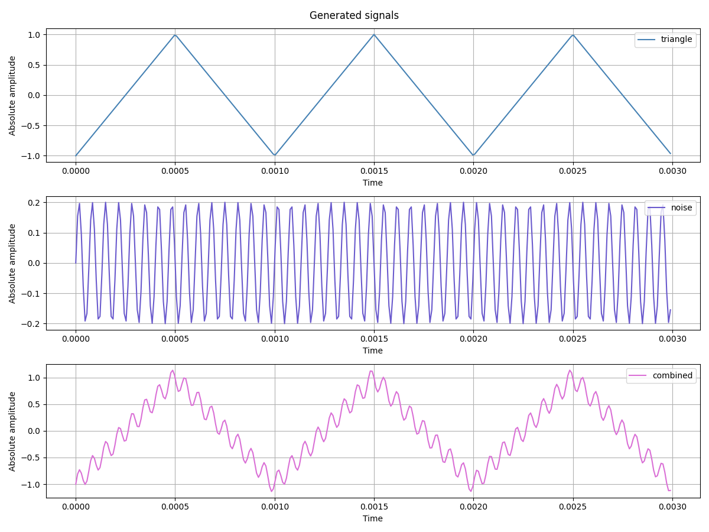
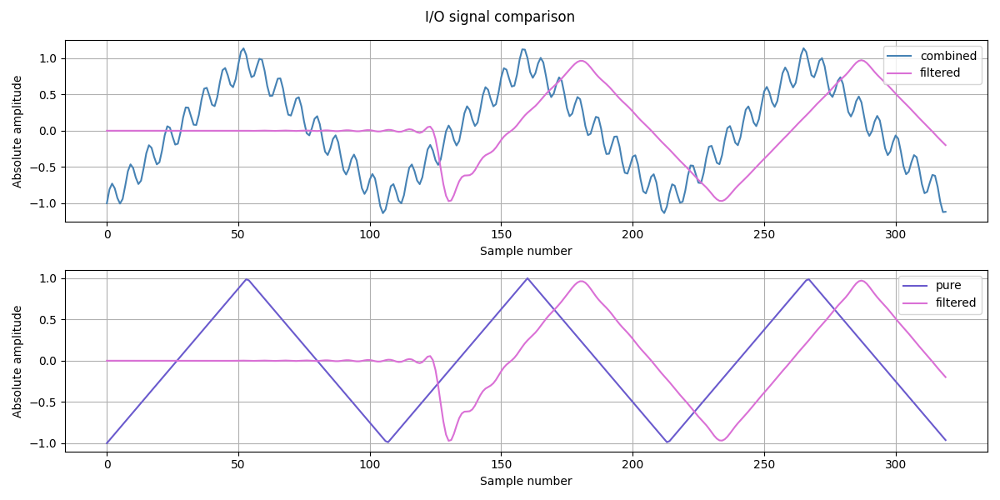

# Description
The current repository contains some Python scripts for:
- Generating a noisy signal
- Calculating the coefficients of a finite impulse response (FIR) filter
- Comparing signals on charts
- Performing a fast Fourier transform (FFT) to evaluate filtering efficiency

## Notes
This time it is aimed primarily for use alongside with Cortex-based MCUs and the CMSIS DSP software library.  
But windows machine is used because of its extended debug capability.  
So CMSIS `arm_fir_f32` and `arm_fir_init_f32` functions are implemented in  
form of DLL with minor changes to be used by a console application.

## Sequence of application
1. Run `GenerateSignal.py`

2. Use `GetCoefficients.ipynb` to interract with notebook and calculate filter coefficients   
3. In `arm_fir_example_f32.cpp` replace definitions and coefficients with new values 
4. Run `fir.exe` to get filtered signal values
5. Run `CompareSignal.py`

6. Run `PerformFFT.py`

